# :speech_balloon: PTDA: Progressive Pseudo-Label Learning for Cross-Domain Cloud Detection in High-Resolution Remote Sensing
<div align=center>
  <a href="https://github.com/miguelag99/Efficient-Instance-Prediction/blob/main/CHANGELOG.md">
    
  </a>
  
    
  </a>
  <a href="https://pytorch.org">
    
  </a>
  <a href="https://lightning.ai/docs/pytorch/stable/">
    
  </a>
  <a href="https://www.docker.com">
    
  </a>
</div>

**This repository contains the official Pytorch implementation of training & evaluation code for** [[PTDA](github.com/gasking/PTDA)] :point_left:

<div align="center">
  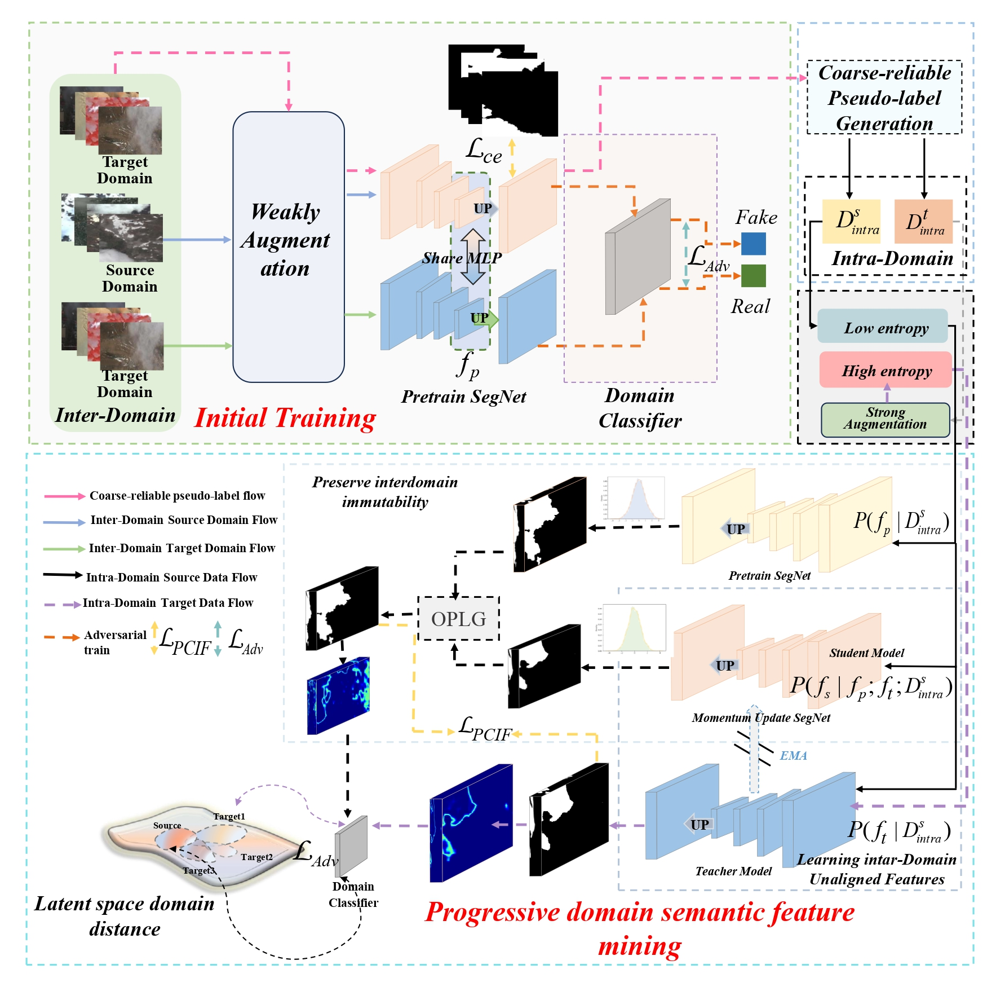
</div>
<p align="center">
  Figure 1: Overview of PTDA framework(where the green box is the first stage of domain-invariant feature learning, the blue box
is the sample division of the target domain through entropy and IoU, the black box is the data enhancement means of different
domains, and the cyan box is the progressive pseudo-label learning stage)
</p>


## Abstract:
**The global cloud detection of high-resolution remote sensing images (HRSI) is crucial for acquiring high quality imagery and optimizing data utilization. Traditional cloud detection models, which rely on limited samples and fully supervised learning, struggle to adapt to cross-temporal and cross-spatial domains. While current unsupervised domain adaptation (UDA) methods improve performance in cross-domain cloud detection to some extent, generating high-quality, reliable pseudo-labels remains a significant challenge for global cloud detection. Therefore, this paper proposes a progressive pseudo label learning for cross-domain cloud detection in high-resolution remote sensing (PTDA). Firstly, we propose an online domain invariant feature guided pseudo-label generation (OPLG) strategy and learning intra-domain unaligned features (LIUF), which effectively integrate domain-invariant features and intra-domain semantics to generate high-quality pseudo-labels at the feature level. LIUF then refines the pseudo-label quality at the pixel level. Secondly, during the model training, pseudo-label constrained intra-domain feature mining loss(PCIF Loss) is designed to suppress noisy semantic information within the domain, the hole effect of thick/thin clouds, and the noise interference of the contour boundary. Four cloud detection datasets, including MS Cloud (MS), HRC WHU Cloud (WHU), 95 Cloud(95), and WHUS2-CD+(S2), are grouped into three cross-domain tests, MS2WHU, MS2S2, and WHU295. Our approach achieved the best performance with mIoU 63.99%, 58.14%, 58.82%, and OA 80.03%, 79.36%, 84.49%, respectively. The experimental results show that the proposed method performs seven state-of-art cross domain comparison methods. Thus, our method has important application value for cross-domain cloud detection. The available code can be downloaded from [[PTDA]](https://github.com/gasking/PTDA).**


## Installation
*We use [Pytorch1.13.1 + CUDA11.8] as  a software configuration environment.*

### Environment Installation
```
conda create -n PTDA python=3.8
conda activate PTDA
conda install pytorch torchvision torchaudio cudatoolkit -c pytorch

pip config set global.index_url=http://mirrors.aliyun.com/pypi/simple/
pip install numpy==1.24.4
pip install Pillow==9.3.0
tensorboardX==2.6.2.2
```

## Dataset 
- **MS Cloud Dataset:** https://drive.google.com/file/d/15YE5OVRV8CbRU5RwrUOhq9RlbWZ6ifYO/view?usp=sharing
- **HRC_WHU Cloud Dataset:** http://gpcv.whu.edu.cn/data/WHU_Cloud_Dataset.html
- **l95 Cloud Dataset:** https://github.com/SorourMo/95-Cloud-An-Extension-to-38-Cloud-Dataset
- **WHU-CDS2+:** https://github.com/Neooolee/WHUS2-CD


## Results
### MS2WHU
* ***Quantitative analysis results of various methods in MS Cloud ->HRC_WHU cross-domain data set, the results are displayed in %; The last is listed as the average IoU. BOLD VALUES INDICATE THE BEST RESULTS***
<div align="center">
  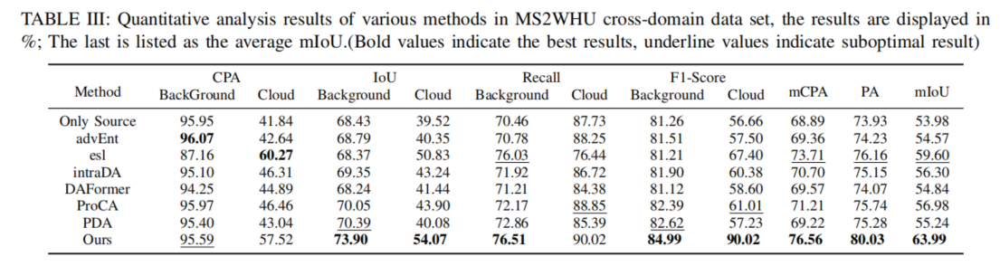
</div>
<p align="center">
  Quantitative analysis results of various methods in MS2WHU cross-domain data set, the results are displayed in %; The last is listed as the average IoU. BOLD VALUES INDICATE THE BEST RESULTS
</p>

*  ***MS Cloud -> HRC_WHU cross-domain visualization result Green: BackGround; White: Cloud)***
<div align="center">
  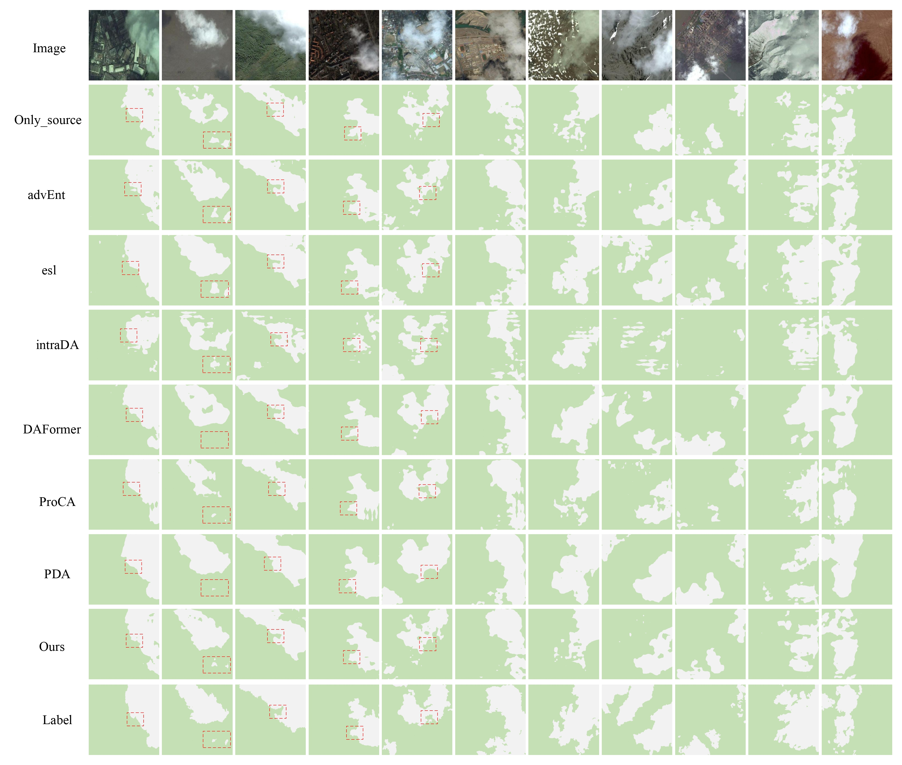
</div>
<p align="center">
  MS Cloud -> HRC_WHU cross-domain visualization result Green: BackGround; White: Cloud)
</p>

### MS Cloud -> WHU-CDS2+ Cloud(MS2S2)
* ***Quantitative analysis results of various methods in MS2S2 cross-domain data set, the results are displayed in %; The last is listed as the average IoU. BOLD VALUES INDICATE THE BEST RESULTS.***
<div align="center">
  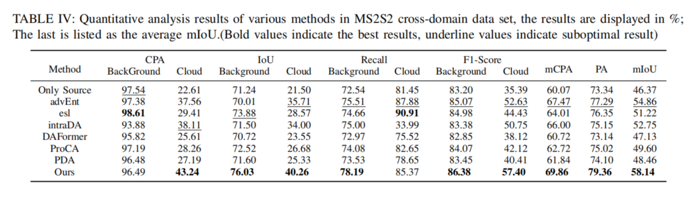
</div>
<p align="center">
  Quantitative analysis results of various methods in MS2S2 cross-domain data set, the results are displayed in %; The last is listed as the average IoU. BOLD VALUES INDICATE THE BEST RESULTS.
</p>

* ***MS2S2  cross-domain visualization result Green: BackGround; White: Cloud***
<div align="center">
  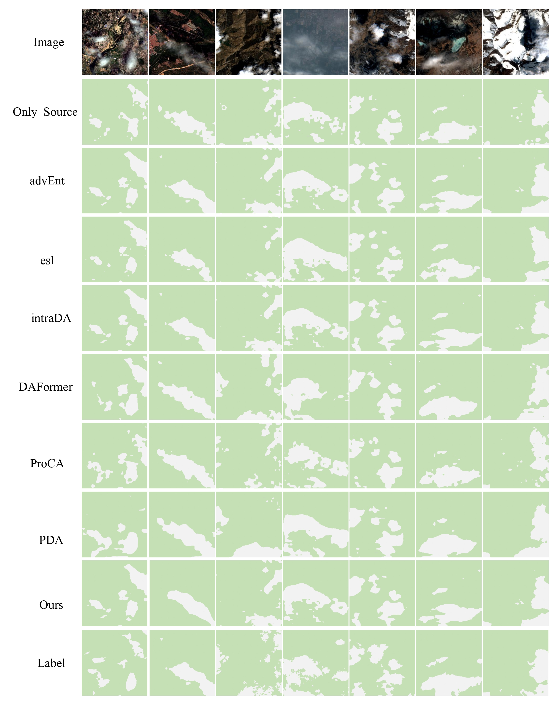
</div>
<p align="center">
  MS2S2 cross-domain visualization result Green: BackGround; White: Cloud)
</p>


### HRC_WHU Cloud -> 95 Cloud Cloud(WHU295)
* ***Quantitative analysis results of various methods in WHU295 cross-domain data set, the results are displayed in %; The last is listed as the average IoU. BOLD VALUES INDICATE THE BEST RESULTS.***
<div align="center">
  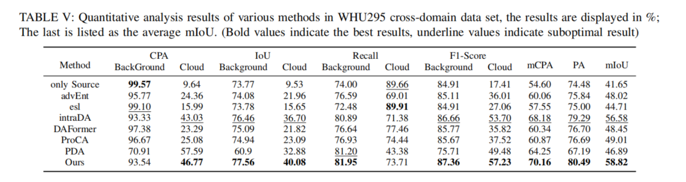
</div>
<p align="center">
  Quantitative analysis results of various methods in WHU295 cross-domain data set, the results are displayed in %; The last is listed as the average IoU. BOLD VALUES INDICATE THE BEST RESULTS.
</p>

* ***WHU295  cross-domain visualization result Green: BackGround; White: Cloud***
<div align="center">
  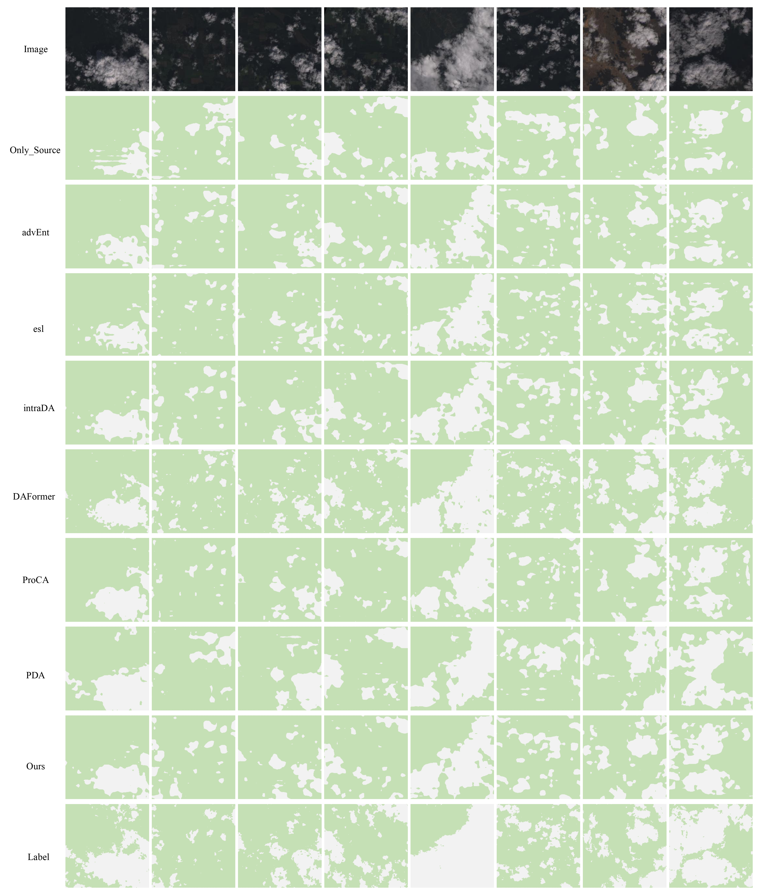
</div>
<p align="center">
  WHU295 cross-domain visualization result Green: BackGround; White: Cloud)
</p>

## Ablation Study
### The effectiveness of the OPLG strategy
* ***The result of the pseudo label ablation experiment for OPLG, the results are displayed in %; The last is listed as
the average mIoU. (Bold values indicate the best results).***
<div align="center">
  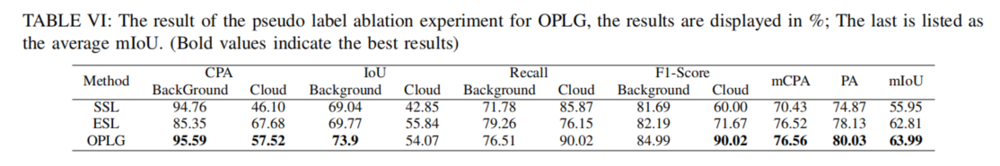
</div>
<p align="center">
 The result of the pseudo label ablation experiment for OPLG, the results are displayed in %; The last is listed as
the average mIoU. (Bold values indicate the best results).
</p>

* ***The visualized result for various pseudo label generation strategies(Green: TP; Yellow: FN; Blue: FP; White: TN***
<div align="center">
  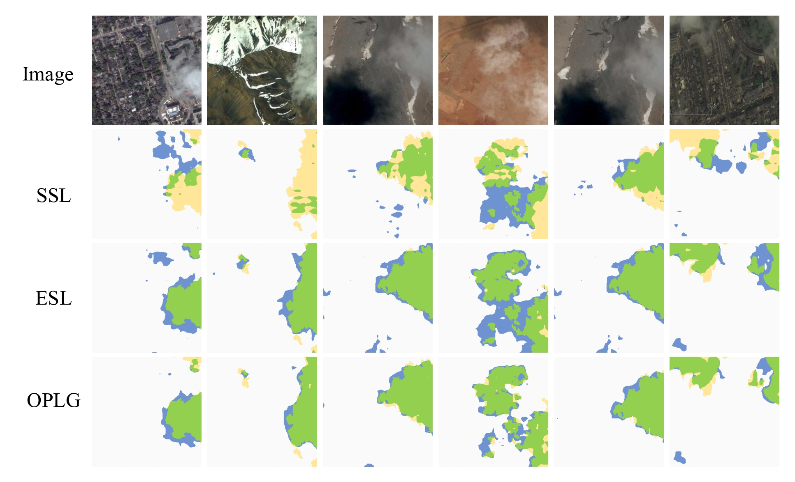
</div>
<p align="center">
 The visualized result for various pseudo label generation strategies(Green: TP; Yellow: FN; Blue: FP; White: TN
</p>


### The different components for impact of network perforemance
* ***The different components for influence of network performance.(Bold values indicate the best results).***
<div align="center">
  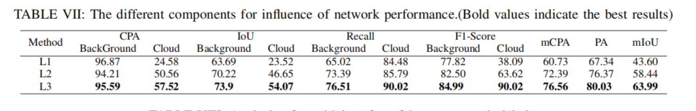
</div>
<p align="center">
The different components for influence of network performance.(Bold values indicate the best results).
</p>


* ***Entropy visualizes cloud boundaries and interiors(As shown in the red box, the greater the entanglement, the higher
the entropy)***
<div align="center">
  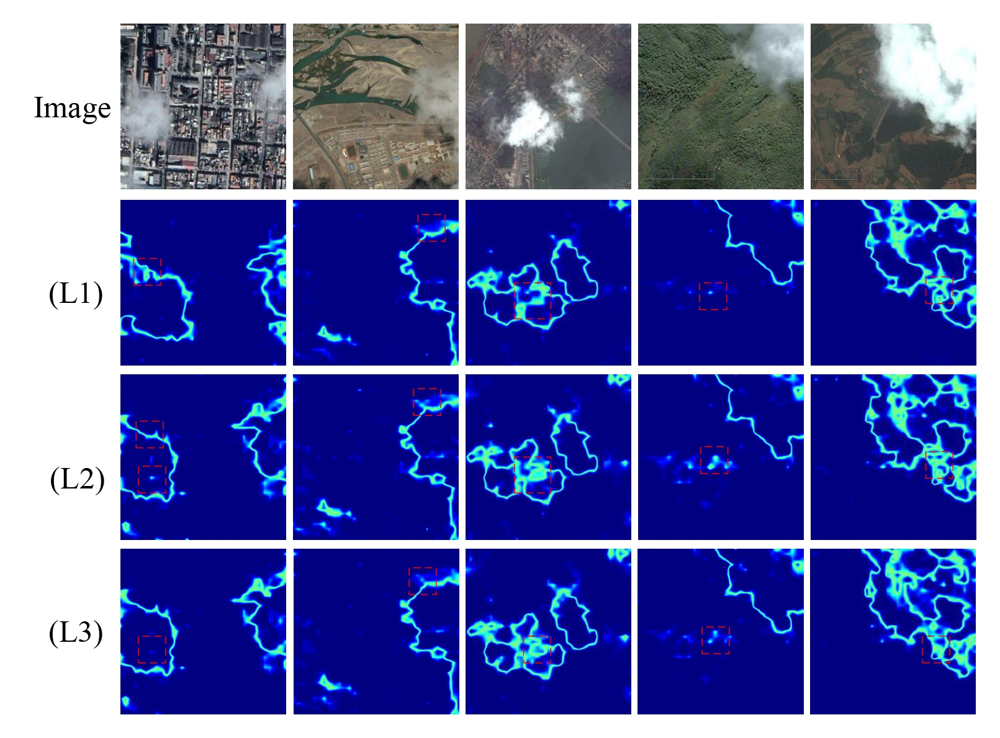
</div>
<p align="center">
 Entropy visualizes cloud boundaries and interiors(As shown in the red box, the greater the entanglement, the higher
the entropy)
</p>


### Hyperparameter sensitivity experiments
* ***Analysis of sensitivity of confidence to pseudo-labels.).***
<div align="center">
  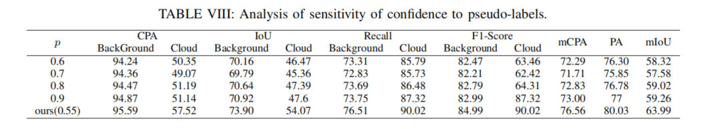
</div>
<p align="center">
The different components for influence of network performance.(Bold values indicate the best results).
</p>

* ***The visualized result for various pseudo label generation strategies(Green: TP; Yellow: FN; Blue: FP; White: TN***
<div align="center">
  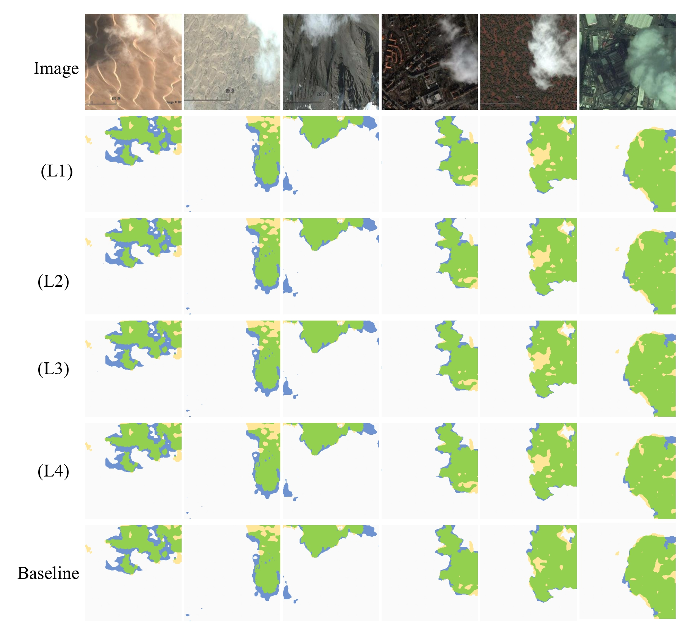
</div>
<p align="center">
</p>


## Discussion
### Cross-domain cloud detection performance of Comparative Model
* ***t-SNE visualizes the segmentation decision boundary***
<div align="center">
  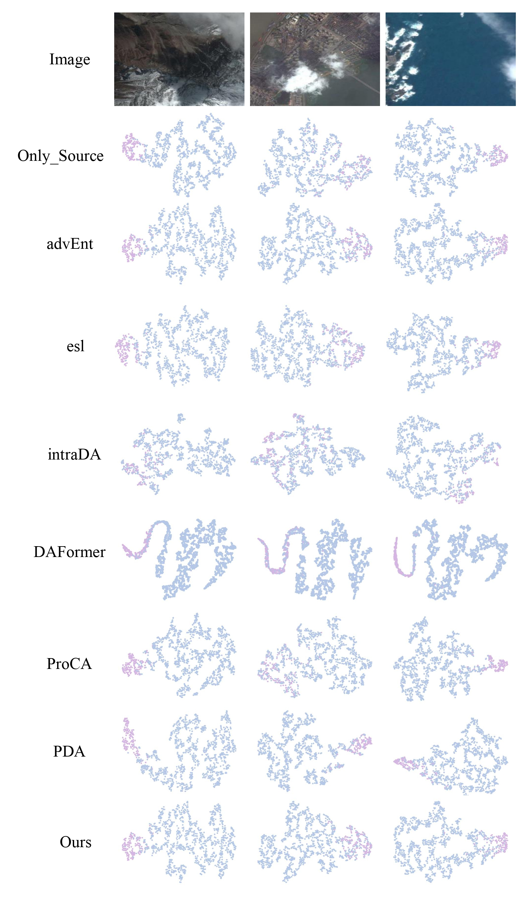
</div>
<p align="center">
 t-SNE visualizes the segmentation decision boundary
</p>


### Corss-Domain influence of feature extractors on Cloud Detection Performance
* ***The different feature extractors on cross-domain cloud detection performance.***
<div align="center">
  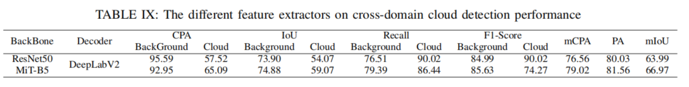
</div>
<p align="center">
 The different feature extractors on cross-domain cloud detection performance
</p>


* ***Visualization of the influence of different feature extractors on cross-domain cloud detection performance***
<div align="center">
  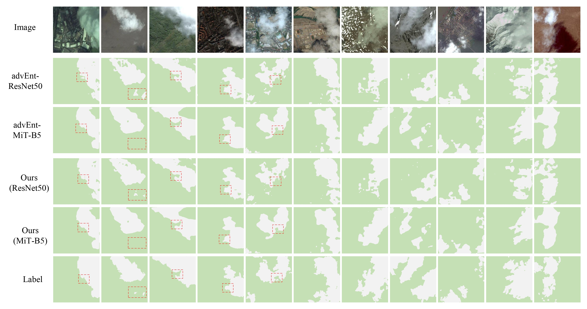
</div>
<p align="center">
 Visualization of the influence of different feature extractors on cross-domain cloud detection performance
</p>


### Cross-Domain Complexity of Cloud Detection Models
* ***The model parameters and computational complexity are analyzed.***
<div align="center">
  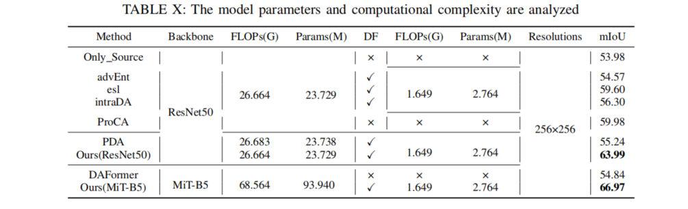
</div>
<p align="center">
The model parameters and computational complexity are analyzed
</p>


## Test
* **Check out eval.sh for test file configuration**
  * ***Mask visualization***
  * ***T-SNE visualization***
  * ***Grad-CAM visualization***
  * ***Entropy Map visualization***

## License
 The code is released under the MIT license[](https://opensource.org/licenses/MIT).

## Relevant Projects
***[1] Semi-Supervised Semantic Segmentation Using Unreliable Pseudo-Labels  - CVPR [[arXiv](https://link.zhihu.com/?target=https%3A//arxiv.org/pdf/2203.03884.pdf) [code](https://github.com/Haochen-Wang409/U2PL)]*** 
***[2] Semantic distribution-aware contrastive adaptation for semantic segmentation  - IEEE TRANSACTIONS ON PATTERN ANALYSIS AND MACHINE INTELLIGENCE*** [**[arXiv](https://arxiv.org/abs/2105.05013) [code](https://github.com/BIT-DA/SDCA)**]

- ***Thanks for their nice contribution.***
